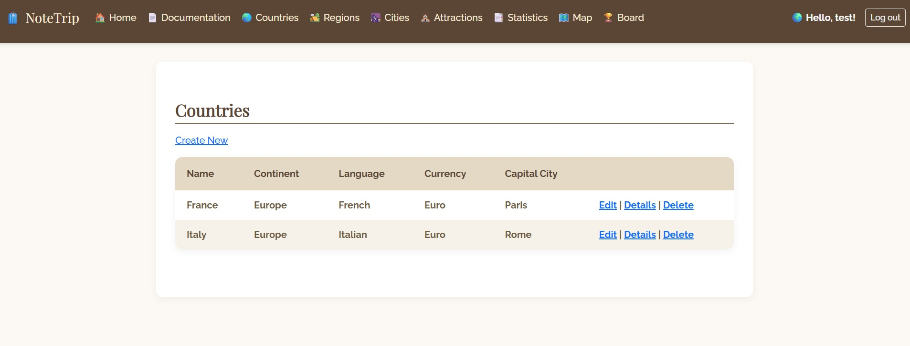
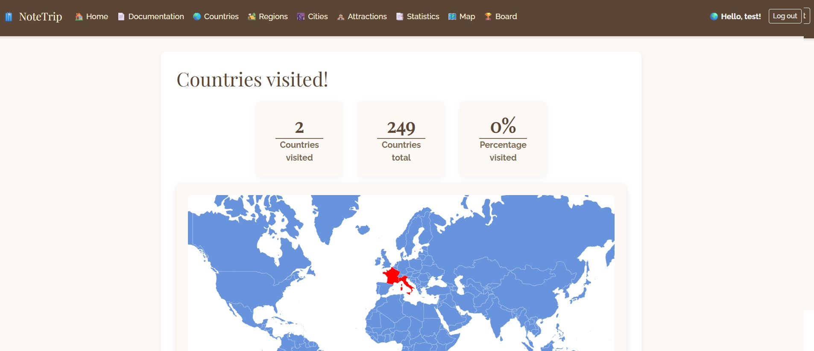
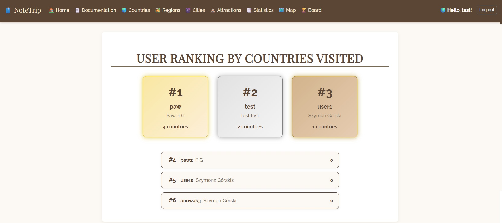

# NoteTrip

**Project created by:** Paweł Gleindek & Szymon Górski, AGH Cracow, EAIiIB Faculty

Trip Helper is a web application designed to help you organize and track your travels. Easily store information about places you’ve visited—or plan to visit—and keep it all neatly organized.

## Features

- **Manage Countries:** Add countries with details such as name, continent, domestic language, currency, and capital city.  
- **Organize Regions:** Create regions and associate them with countries.  
- **Add Cities:** Add cities linked to regions.  
- **Tourist Attractions:** Store attractions in cities you are interested in visiting.  
- **Statistics & Map:** View statistics about the places you've added and see a map highlighting countries you’ve visited.  
- **Leaderboard:** Track your travel progress and compete with other users.  
- **Easy-to-Use Interface:** Intuitive design allows smooth navigation and editing of your data.

Adding countries to your list:



Map with countries you have already visited:



Global users' ranking:



## Technologies

- **Language:** C#  
- **Framework:** .NET ASP.NET Core MVC

## Getting Started

To run the project, make sure you have the appropriate .NET SDK installed. Then, in the main project directory, run:

```bash
dotnet run
```
The website will start, and you can access it through your browser to begin managing your trips.

